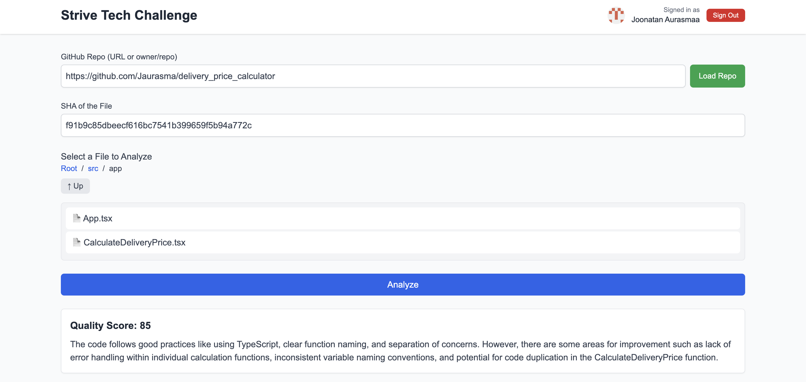

# Code Quality Analyzer


## Table of Contents

- [Introduction](#introduction)
- [Features](#features)
- [Demo](#demo)
- [Getting Started](#getting-started)
  - [Prerequisites](#prerequisites)
  - [Installation](#installation)
  - [Environment Variables](#environment-variables)
  - [Running the Application](#running-the-application)
- [Technologies Used](#technologies-used)
- [Project Structure](#project-structure)

## Introduction

**Code Quality Analyzer** is a Next.js application designed to evaluate the quality of code snippets from GitHub repositories. By leveraging GitHub's API to fetch specific files and OpenAI's powerful language models, this tool provides users with a comprehensive analysis, including a quality score and detailed reasoning. This helps developers maintain high coding standards and identify areas for improvement within their codebases.

## Features

- **GitHub Integration:** Fetches file contents from specified repositories and commit SHAs.
- **Code Analysis:** Utilizes OpenAI's GPT-3.5-Turbo model to assess code quality.
- **Session Management:** Implements authentication using NextAuth for secure access.
- **History Tracking:** Stores and displays a history of analyzed code snippets using `localStorage`.
- **User-Friendly Interface:** Provides an intuitive UI for inputting repository details and viewing analysis results.
- **Retry Mechanism:** Implements a retry strategy for handling API response errors gracefully.

## Demo



_Screenshot showcasing the Code Quality Analyzer interface._

## Getting Started

Follow these instructions to set up and run the project locally.

### Prerequisites

Ensure you have the following installed on your machine:

- [Node.js](https://nodejs.org/en/) (v14 or later)
- [npm](https://www.npmjs.com/) (v6 or later) or [Yarn](https://yarnpkg.com/)
- [Git](https://git-scm.com/)

### Installation

1. **Clone the Repository**

   ```bash
   git clone https://github.com/Jaurasma/strive_tech_challenge.git
   cd code-quality-analyzer
   ```

2. **Install Dependencies**

   Using npm:

   ```bash
   npm install
   ```

   Or using Yarn:

   ```bash
   yarn install
   ```

### Environment Variables

Create a `.env.local` file in the root directory of the project and add the following environment variables:

```env
# GitHub OAuth Credentials
GITHUB_ID=your-github-client-id
GITHUB_SECRET=your-github-client-secret

# NextAuth Secret
NEXTAUTH_SECRET=your-nextauth-secret

# OpenAI API Key
OPENAI_API_KEY=your-openai-api-key

# NextAuth URL
NEXTAUTH_URL=http://localhost:3000
```

**Note:** Replace `your-github-client-id`, `your-github-client-secret`, `your-nextauth-secret`, and `your-openai-api-key` with your actual credentials. Ensure that these keys are kept secure and **never** commit them to version control.

### Running the Application

Start the development server:

Using npm:

```bash
npm run dev
```

Or using Yarn:

```bash
yarn dev
```

Open your browser and navigate to [http://localhost:3000](http://localhost:3000) to view the application.

### Building for Production

To build the application for production:

Using npm:

```bash
npm run build
```

Or using Yarn:

```bash
yarn build
```

Start the production server:

Using npm:

```bash
npm start
```

Or using Yarn:

```bash
yarn start
```

## Technologies Used

- **[Next.js](https://nextjs.org/):** React framework for server-rendered applications.
- **[TypeScript](https://www.typescriptlang.org/):** Superset of JavaScript for static typing.
- **[NextAuth](https://next-auth.js.org/):** Authentication for Next.js applications.
- **[Axios](https://axios-http.com/):** Promise-based HTTP client for the browser and Node.js.
- **[OpenAI API](https://openai.com/api/):** AI models for generating responses.
- **[ESLint](https://eslint.org/):** Linting utility for JavaScript and TypeScript.
- **[Prettier](https://prettier.io/):** Code formatter.

## Project Structure

```
code-quality-analyzer/
├── app/
│   ├── layout.tsx
│   ├── page.tsx
│   └── Providers.tsx
├── components/
│   ├── AuthButtons.tsx
│   ├── CodeQualityForm.tsx
│   ├── SignInButton.tsx
│   ├── SignOutButton.tsx
│   ├── UserMenu.tsx
│   ├── UserProfile.tsx
│   ├── CodeQualityForm.tsx
│   └── FilePicker.tsx
├── pages/
│   ├── api/
│   │   ├── analyze.tsx
│   │   ├── getFileSha.tsx
│   │   ├── analyze.tsx
│   │   └── auth/
│   │       └── [...nextauth].tsx
│   └── _app_.tsx
├── utils/
│   ├── analyzeCodeWithLLM.tsx
│   └── localStorageUtils.tsx
├── types/
│   ├── github.ts
│   └── types.ts
├── styles/
│   └── globals.css
├── .env.local
├── .eslintrc.js
├── package.json
├── tsconfig.json
└── README.md
```

**Key Directories and Files:**

- **`components/`:** Contains React components and their respective tests.
- **`pages/api/`:** Contains Next.js API routes and authentication configuration.
- **`utils/`:** Houses utility functions and their tests.
- **`types/`:** Defines TypeScript interfaces and types.
- **`styles/`:** Contains global and component-specific CSS files.
- **`Dockerfile`:** Configuration for Dockerizing the application.
- **`.eslintrc.js`:** ESLint configuration.
- **`README.md`:** Project documentation.
